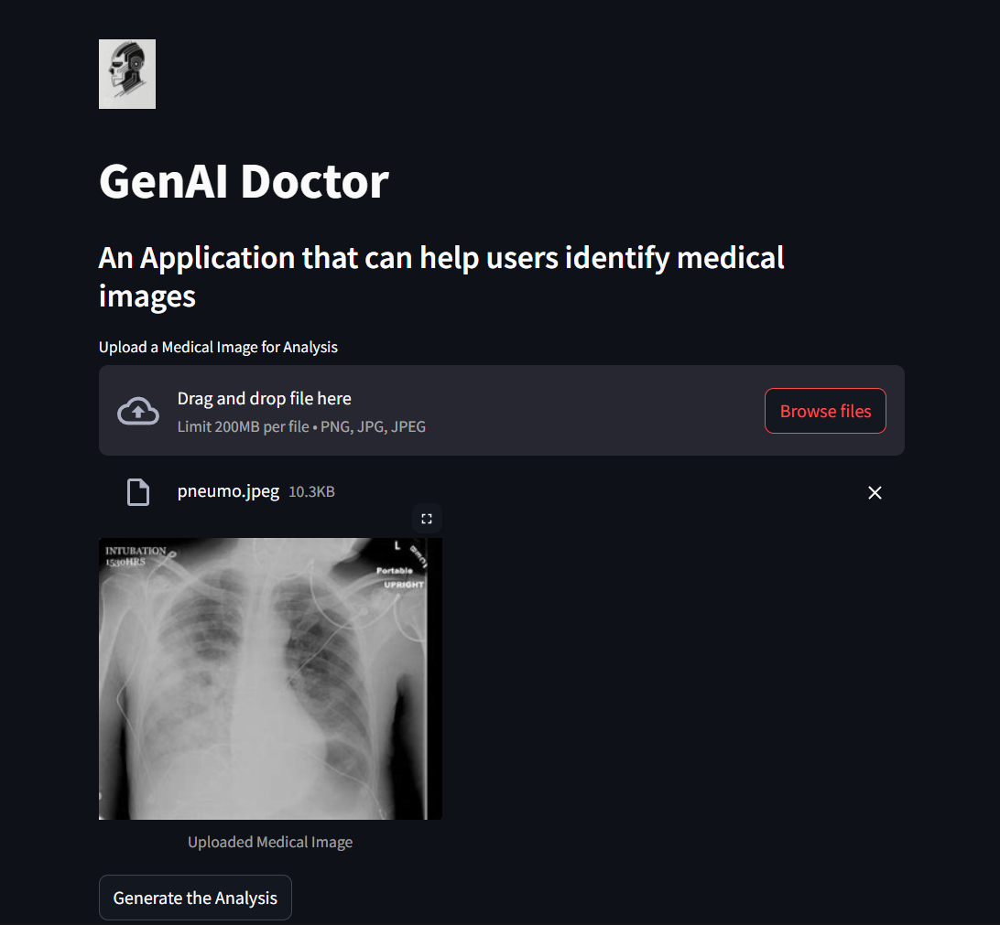
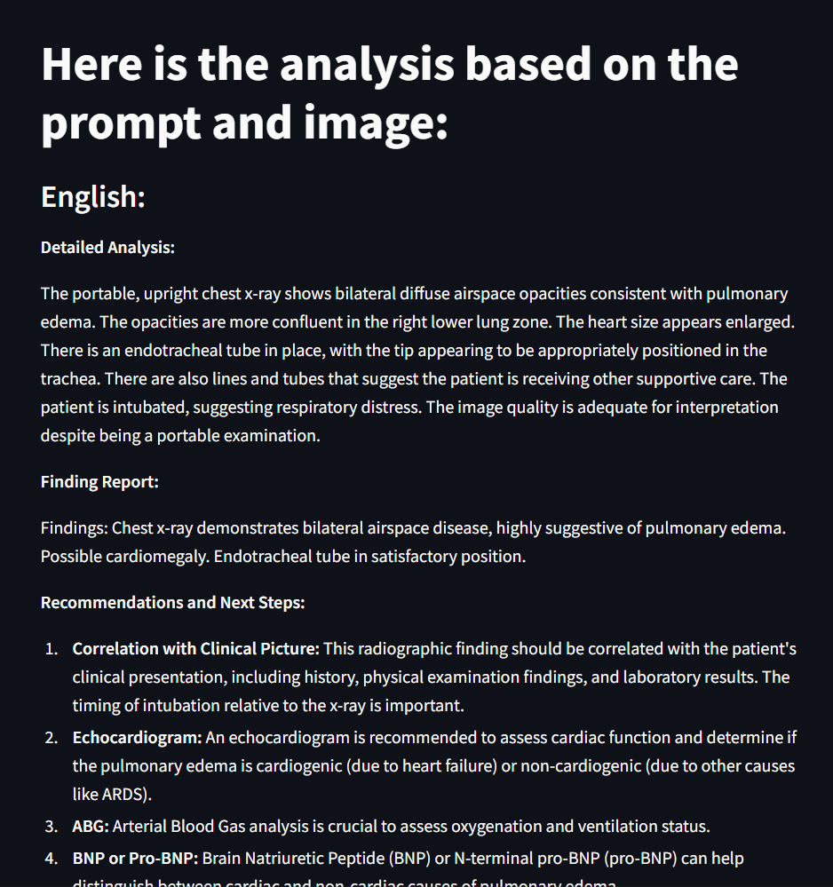
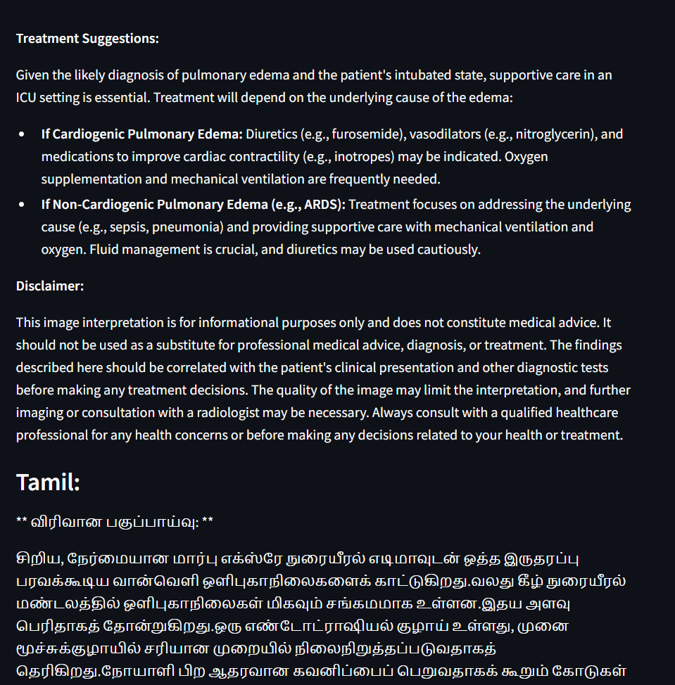
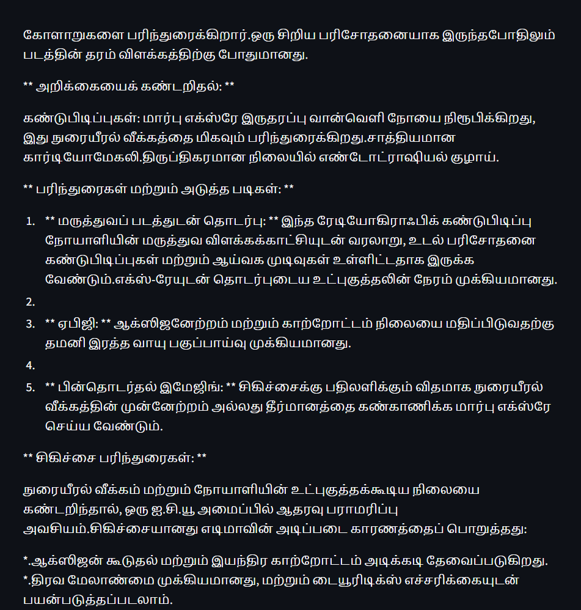

# GENAI-MEDICAL-IMAGE-ANALYZER
# GenAI Medical Image Analyzer

## Overview
The GenAI Medical Image Analyzer is a cutting-edge AI-powered tool designed for analyzing medical images with precision and efficiency. Leveraging state-of-the-art generative AI and deep learning techniques, this tool assists medical professionals in identifying patterns, diagnosing conditions, and generating actionable insights from complex medical imaging data.

## Features
- **Automated Image Analysis**: Supports X-rays, MRIs, CT scans, and more.
- **AI-Powered Diagnostics**: Provides probabilistic insights into potential conditions.
- **Interactive Visualization**: Heatmaps and overlays highlight areas of interest.
- **Customizable Models**: Fine-tune or integrate your own AI models.
- **Data Privacy**: Complies with HIPAA and other medical data protection regulations.

## Prerequisites
- **Python 3.8+**
- **Hardware**: GPU-enabled system recommended (NVIDIA CUDA support preferred).
- **Libraries**: The following Python libraries are required:
  - TensorFlow / PyTorch
  - OpenCV
  - NumPy
  - Matplotlib
  - Flask or FastAPI (for serving the model)

## Installation
1. Clone the repository:
   ```bash
   git clone https://github.com/your-repo/genai-medical-analyzer.git
   cd genai-medical-analyzer
   ```
2. Install the required dependencies:
   ```bash
   pip install -r requirements.txt
   ```
3. Ensure your GPU drivers and CUDA are properly configured (if applicable).

## Usage
1. **Preprocess Images**:
   Place your medical images in the `data/input/` folder.
2. **Run Analysis**:
   Use the following command to analyze the images:
   ```bash
   python analyze.py --input data/input/ --output results/
   ```
3. **View Results**:
   - Raw results will be saved in the `results/` folder.
   - Use the visualization tool:
     ```bash
     python visualize.py --input results/
     ```
4. **Serve via API** (optional):
   Start the web server:
   ```bash
   python app.py
   ```
   Access the web app at `http://localhost:5000`.

## Configuration
Edit the `config.yaml` file to adjust settings such as:
- Model paths
- Thresholds for detection
- Output formats

## Example
### Input:


### Output:





## Contributing
We welcome contributions! Please follow these steps:
1. Fork the repository.
2. Create a new branch for your feature/fix.
3. Submit a pull request.

## License
This project is licensed under the MIT License. See the [LICENSE](LICENSE) file for details.
MIT License

Copyright (c) [2025] [MURALITHARAN P]

Permission is hereby granted, free of charge, to any person obtaining a copy
of this software and associated documentation files (the "Software"), to deal
in the Software without restriction, including without limitation the rights
to use, copy, modify, merge, publish, distribute, sublicense, and/or sell
copies of the Software, and to permit persons to whom the Software is
furnished to do so, subject to the following conditions:

The above copyright notice and this permission notice shall be included in all
copies or substantial portions of the Software.

THE SOFTWARE IS PROVIDED "AS IS", WITHOUT WARRANTY OF ANY KIND, EXPRESS OR
IMPLIED, INCLUDING BUT NOT LIMITED TO THE WARRANTIES OF MERCHANTABILITY,
FITNESS FOR A PARTICULAR PURPOSE AND NONINFRINGEMENT. IN NO EVENT SHALL THE
AUTHORS OR COPYRIGHT HOLDERS BE LIABLE FOR ANY CLAIM, DAMAGES OR OTHER
LIABILITY, WHETHER IN AN ACTION OF CONTRACT, TORT OR OTHERWISE, ARISING FROM,
OUT OF OR IN CONNECTION WITH THE SOFTWARE OR THE USE OR OTHER DEALINGS IN THE
SOFTWARE.


## Acknowledgments
- Thanks to the open-source AI and medical imaging communities for their invaluable resources.
- Special gratitude to healthcare professionals who provided insights for model training.

## Contact
For questions or support, please contact [your-email@example.com](mailto:muralitharanparameswaran2004@gmail.com).

---
Feel free to open an issue in the GitHub repository for bug reports or feature requests!
